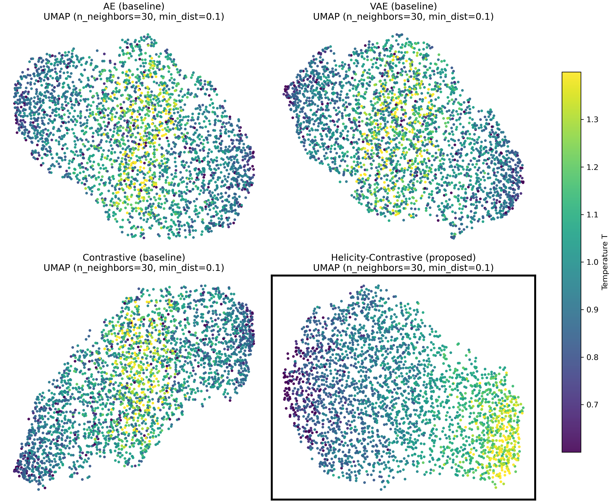
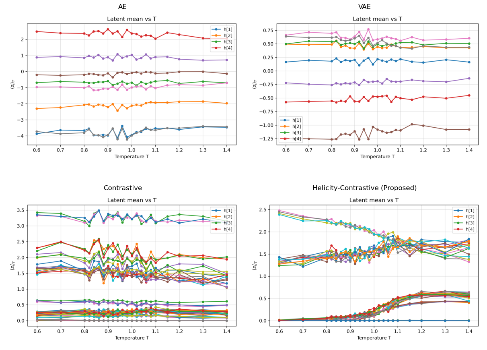
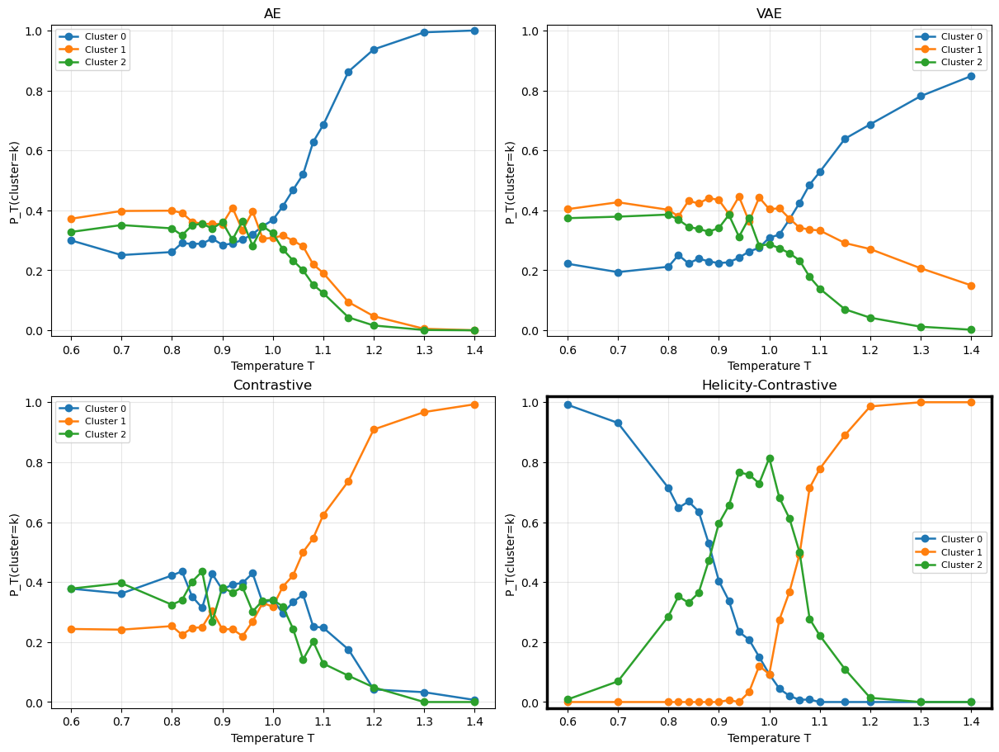
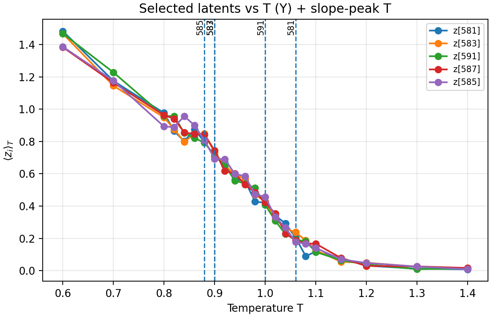
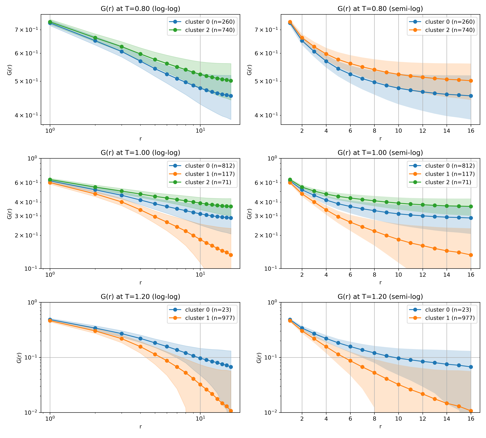

# Physics-Aware Representation Learning for the KT Transition

Unsupervised learning of the Kosterlitz–Thouless (KT) transition in the 2D XY model,  
using a **helicity-constrained contrastive objective** to encode topological phase structure  
into latent space without supervision.

---

## Research Question

Standard ML approaches to phase transitions frame the problem as binary classification.  
The KT transition has **no spontaneous symmetry breaking**, so binary classification is  
fundamentally inapplicable.

Instead, this project asks:

> **Can an unsupervised latent space reflect the intrinsic physical structure of a topological transition?**

We reframe transition detection as a question of **representation quality under objective design**,  
and evaluate whether injecting weak physical bias (helicity modulus Υ) improves latent geometry.

---

## Physical Background

### 2D XY Hamiltonian

$$H = -J \sum_{\langle i,j \rangle} \cos(\phi_i - \phi_j)$$

Spins $\phi_i \in (-\pi, \pi]$ on a square lattice with periodic boundary conditions.

### The KT Transition

| Temperature | Physical picture |
|-------------|-----------------|
| $T < T_c$ | Vortex pairs bound. Spin-wave regime. $G(r) \sim r^{-\eta(T)}$ power-law decay. |
| $T \approx T_c$ | Universal helicity jump: $\Upsilon(T_c^-) = 2T_c/\pi$, $\eta(T_c) = 1/4$ |
| $T > T_c$ | Vortex unbinding. $G(r) \sim e^{-r/\xi}$ exponential decay. |

### Helicity Modulus

$$\Upsilon = \langle \cos \Delta\phi \rangle - \beta \frac{\langle (\sum \sin \Delta\phi)^2 \rangle}{L^2}$$

The sharpest indicator of the KT transition: drops discontinuously to zero at $T_c$.

---

## Proposed Method

### Objective Functions

| Model | Objective |
|-------|-----------|
| AE | $\mathcal{L} = \|x - \hat{x}\|^2$ |
| VAE | $\mathcal{L} = \mathcal{L}_{\text{recon}} + \beta \, D_{\text{KL}}$ |
| Contrastive (SimCLR) | $\mathcal{L} = \mathcal{L}_{\text{NT-Xent}}$ |
| **Helicity-Contrastive (proposed)** | $\mathcal{L} = \mathcal{L}_{\text{NT-Xent}} + \lambda_\Upsilon \, \mathcal{L}_\Upsilon$ |

### Architecture

The helicity regression head attaches to encoder output $h$ (pre-projector),  
injecting physical bias without collapsing the contrastive representation.

```
input φ → Encoder → h ──→ Projector → z → NT-Xent loss
                    └──→ Helicity Head → Υ̂ → MSE loss
```

---

## Key Results

### UMAP Latent Geometry (4-model comparison)

Only the proposed method (bottom-right) produces a temperature-structured embedding.



---

### Latent Mean vs Temperature

The proposed method shows coherent, monotonic temperature dependence across multiple latent dimensions.



---

### Cluster Probability vs Temperature

The proposed method (bottom-right) autonomously discovers a clean three-regime structure.  
AE, VAE, and Contrastive baselines show near-random cluster assignments.



---

### Transition Sensitivity: Latent Slope Peaks

Top-correlated latent dimensions show slope peaks at $T \approx 0.88$–$1.06$,  
consistent with the finite-size estimate $T_c \approx 0.893$ for $L = 32$.



---

### Correlation with Physical Observables

Despite being fully unsupervised, the proposed model's latent dimensions exhibit  
significant Spearman correlation with both KT transition indicators:

| Observable | Top latent dim | Spearman $r$ |
|------------|---------------|-------------|
| Helicity modulus Υ | z[581] | **0.659** |
| Vortex density $n_v$ | z[1116] | **0.791** |

---

### Cluster-Conditional Correlation Functions

$G(r)$ conditioned on cluster labels reproduces the theoretically expected  
power-law (low-$T$) vs exponential (high-$T$) decay behavior.



---

### 4-Model Quantitative Summary

| Model | Latent temperature structure | 3-regime separation | Spearman (Υ) | Spearman ($n_v$) |
|-------|:---------------------------:|:-------------------:|:------------:|:----------------:|
| AE | None | × | — | — |
| VAE | None | × | — | — |
| Contrastive | None | × | — | — |
| **Helicity-Contrastive (proposed)** | **Clear** | **✓** | **0.659** | **0.791** |

---

## Repository Structure

```
kt-transition-xy-model/
├── MCsim/                          # Monte Carlo simulation engine
│   ├── config.py                   # Experiment config (JSON-serializable dataclass)
│   ├── xy_model.py                 # Data structures: XYState, RunBuffers, CorrBins
│   ├── angles.py                   # Angle arithmetic and PBC utilities
│   ├── update.py                   # Metropolis / Over-relaxation / Wolff updates
│   ├── measure.py                  # Observables: Υ, G(r), vortex detection, heat capacity
│   ├── analysis.py                 # Tc estimation, power-law / exponential fits
│   ├── initial.py                  # Lattice initialization (random, uniform, vortex pair)
│   ├── loop.py                     # Temperature sweep orchestration
│   └── check.py                    # KT theory consistency checks
│
└── Unsupervised_Machine_Learning/
    ├── configs/                    # YAML experiment configs
    ├── models/
    │   ├── nn_utils.py             # Shared blocks: ConvBlock, DeconvBlock, get_activation
    │   ├── auto_encoder.py         # Convolutional AE
    │   ├── vae.py                  # Convolutional VAE
    │   ├── contrastive_encoder.py  # SimCLR encoder
    │   └── helicity_head.py        # Helicity regression head (proposed method)
    ├── dataset/
    │   └── unsupervised_xy_dataset.py  # XY spin dataset with physics-preserving augmentations
    ├── train/
    │   ├── train_contrastive.py          # SimCLR training
    │   └── train_helicity_contrastive.py # Proposed method training
    ├── analysis/
    │   ├── latent_extraction.py          # Extract latent representations (all 4 models)
    │   ├── latent_vs_T.py                # Temperature-dependent latent statistics
    │   ├── cluster_vs_T.py               # Cluster probability vs temperature
    │   ├── kmeans_tsne.py                # K-means + t-SNE visualization
    │   ├── corr_ranking_latent_vs_observables.py  # Correlation with physical observables
    │   ├── Cluster_cond_G_r.py           # Cluster-conditional G(r)
    │   └── plot_selected_latent_vs_T.py  # Slope-peak visualization
    └── utils/
        ├── lambda_schedule.py    # λ weight scheduler
        └── physics_utils.py      # Standalone physics utilities (ML-module-independent)
```

---

## Setup

```bash
git clone https://github.com/taro-univ/kt-transition-xy-model.git
cd kt-transition-xy-model
pip install -r requirements.txt
```

| Library | Version |
|---------|---------|
| Python | 3.11 |
| PyTorch | >= 2.2 |
| NumPy | >= 1.26 |
| scikit-learn | >= 1.4 |

> **Reproducibility**: Set `seed` (integer) in `MCsim/config.py` to fix simulation RNG.  
> Training-side reproducibility is controlled via `torch.manual_seed()` in each training script.

---

## Experiment Pipeline

### Step 1 — Monte Carlo simulation

```bash
python MCsim/loop.py
```

Config in `MCsim/config.py` controls lattice size, temperature grid, sweep counts, and RNG seed.  
Results are written to `results/run-{timestamp}/` as JSON, with `config.json` for full reproducibility.

### Step 2 — Prepare dataset

Export simulation outputs to `.npz` format:  
`phi (N, L, L)`, temperature labels `T (N,)`, helicity targets `Y (N,)`.

### Step 3 — Train models

```bash
# Proposed method
python Unsupervised_Machine_Learning/train/train_helicity_contrastive.py \
    --config Unsupervised_Machine_Learning/configs/helicity_contrastive.yaml

# SimCLR baseline
python Unsupervised_Machine_Learning/train/train_contrastive.py \
    --config Unsupervised_Machine_Learning/configs/contrastive.yaml
```

### Step 4 — Extract latent representations

```bash
python Unsupervised_Machine_Learning/analysis/latent_extraction.py \
    --model_type helicity_contrastive
```

Supports `autoencoder` / `vae` / `contrastive` / `helicity_contrastive`.

### Step 5 — Analysis

```bash
# Temperature dependence
python Unsupervised_Machine_Learning/analysis/latent_vs_T.py \
    --latent Unsupervised_Machine_Learning/results/latent/helicity_contrastive/helicity_contrastive_latent.npz

# Correlation with physical observables
python Unsupervised_Machine_Learning/analysis/corr_ranking_latent_vs_observables.py \
    --latent <latent.npz> --mc_npz <dataset.npz> --targets Y,nv
```

---


### Script-to-output mapping

Heavy computations are separated from notebooks to keep them lightweight and reproducible.

| Output | Script |
|--------|--------|
| `*_latent.npz` | `analysis/latent_extraction.py` |
| `*_mean_vs_T.png` | `analysis/latent_vs_T.py` |
| `*_cluster_vs_T.png` | `analysis/cluster_vs_T.py` |
| `*_tsne_*.png` | `analysis/kmeans_tsne.py` |
| `corr_*.csv / corr_*.png` | `analysis/corr_ranking_latent_vs_observables.py` |
| `cluster_cond_G_r_*.png` | `analysis/Cluster_cond_G_r.py` |
| `*_with_peaks.png` | `analysis/plot_selected_latent_vs_T.py` |

---

*Physics × Machine Learning — structured representation learning for topological phase transitions.*
