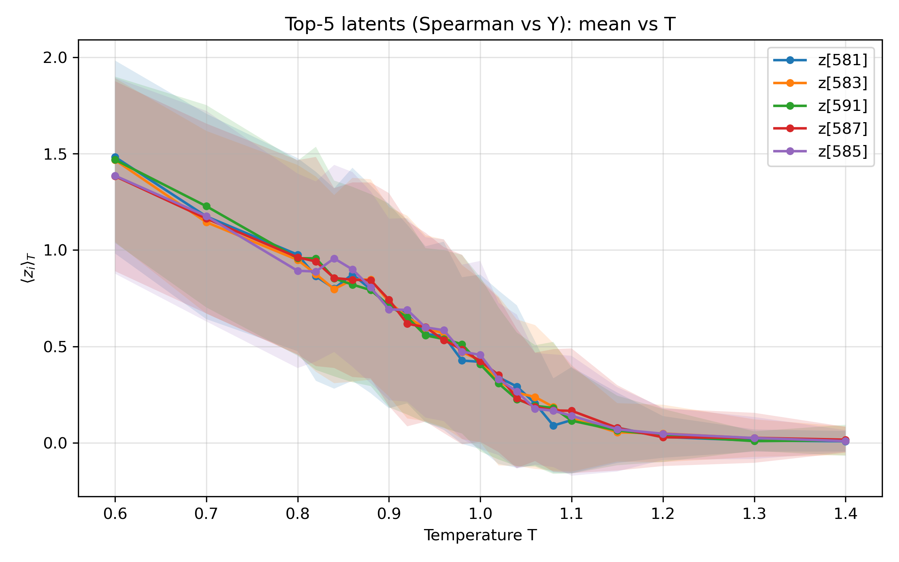
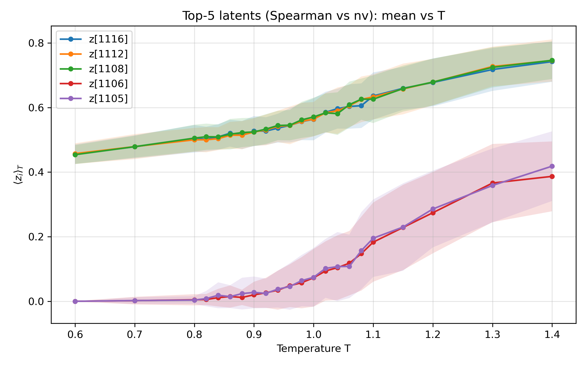
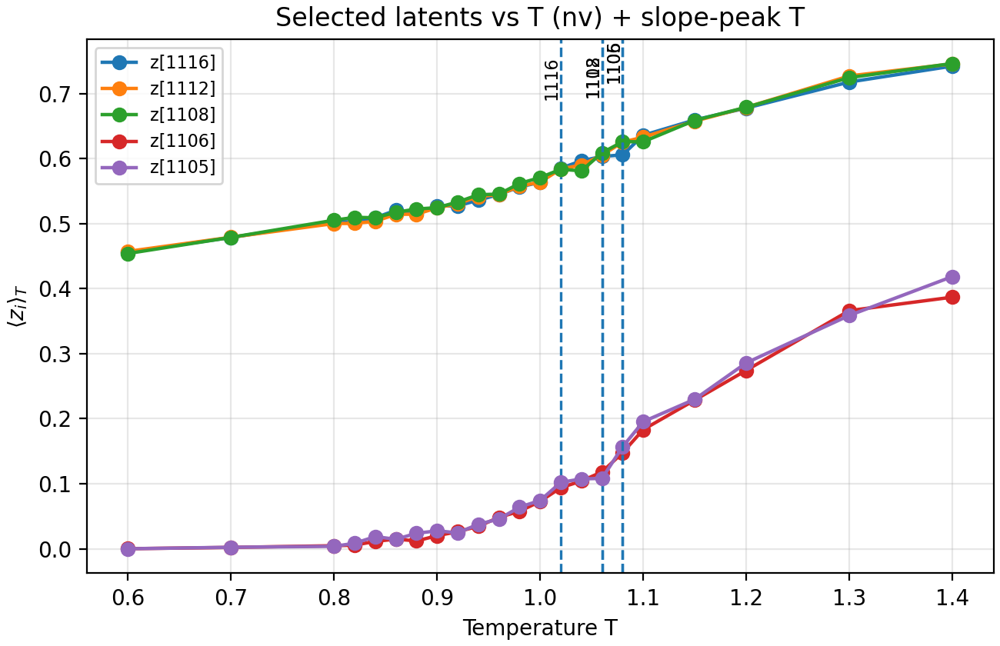

# Representation Learning for the 2D XY Model

## Executive Summary

This project investigates whether physics-aware representation learning
can better capture phase structure in the 2D XY model.

Key findings:

- Helicity-aware contrastive learning reveals a clear three-regime structure.
- Cluster dominance shifts consistently across temperature.
- Latent sensitivity peaks near the estimated critical temperature.

These results suggest that incorporating domain knowledge
improves structural fidelity in unsupervised learning.
Unlike symmetry-breaking transitions, the KT transition does not admit a simple binary phase structure, making it a challenging benchmark for representation learning.

The project emphasizes objective design, latent geometry analysis,
and reproducible evaluation pipelines.

## Why This Matters

This experiment demonstrates how incorporating domain-specific signals
into representation learning can improve structural interpretability.

The approach is generalizable to:
- Scientific machine learning
- Structured data representation
- Physics-informed AI systems

This study reframes phase detection as a representation learning problem rather than a classification problem.


## 1. Problem Setting

### Background

The 2D XY model exhibits the Kosterlitz–Thouless (KT) transition — a topological phase transition that does not involve spontaneous symmetry breaking or a simple two-phase structure.

Instead, the system shows:

- A low-temperature quasi-ordered phase  
- A high-temperature disordered phase  
- A nontrivial intermediate regime driven by vortex unbinding  

This makes phase identification nontrivial using standard binary classification.

---

### Motivation

Many machine learning studies frame phase detection as a two-class problem (ordered vs disordered).  
However, such approaches may:

- Impose an artificial two-phase interpretation  
- Overlook intermediate structures  
- Collapse transitional regimes in latent space  

Our objective is different.

Rather than classifying phases, we aim to:

> Learn latent representations that faithfully encode the intrinsic structural organization of the system across temperature.

---

### Research Question

Can representation learning:

1. Separate low- and high-temperature regimes?
2. Reveal a continuous intermediate structure?
3. Align latent dimensions with physically meaningful observables?

---

### Approach

We compare four unsupervised methods:

- Autoencoder (AE)  
- Variational Autoencoder (VAE)  
- Contrastive learning  
- **Helicity-Contrastive learning (proposed)**  

We evaluate representations through:

- UMAP geometry  
- Temperature-dependent clustering  
- Correlation with physical observables  

The central question is whether helicity-aware training improves structural fidelity in latent space.

## 2. UMAP Comparison
To qualitatively compare the geometric structure of latent spaces across models,
we project each representation to 2D using UMAP.

For fair comparison:
- Same UMAP hyperparameters are used for all models.
- A fixed random seed ensures reproducibility.
- At most 3000 samples are used for visualization consistency.

Color indicates temperature \(T\).

This visualization allows us to inspect:
- Whether low- and high-temperature regimes separate clearly
- Whether an intermediate regime emerges
- Whether the proposed helicity-aware model exhibits improved structural organization
## UMAP Comparison


<details>
<summary>Show code: UMAP visualization (AE / VAE / Contrastive / Helicity-Contrastive)</summary>

```python
# === UMAP visualization cell (AE / VAE / Contrastive / Helicity-Contrastive) ===
# Assumes you run from: notebooks/ (so ../results/notebook_data exists)

from pathlib import Path
import numpy as np
import matplotlib.pyplot as plt

# --- Config ---
DATA_DIR = Path("results/notebook_data")

files = {
    "AE (baseline)": DATA_DIR / "ae_latent.npz",
    "VAE (baseline)": DATA_DIR / "vae_latent.npz",
    "Contrastive (baseline)": DATA_DIR / "contrastive_latent_small.npz",
    "Helicity-Contrastive (proposed)": DATA_DIR / "helicity_contrastive_latent_small.npz",
}

SEED = 42
N_NEIGHBORS = 30
MIN_DIST = 0.10
N_SAMPLES_MAX = 3000
POINT_SIZE = 6
ALPHA = 0.9

# --- Import UMAP (install message if missing) ---
try:
    import umap
except ImportError as e:
    raise ImportError(
        "UMAP is not installed. Run one of the following in your environment:\n"
        "  pip install umap-learn\n"
        "or (conda)\n"
        "  conda install -c conda-forge umap-learn"
    ) from e


def load_latent(npz_path: Path, n_max: int, seed: int):
    d = np.load(npz_path)
    if "z" not in d or "T" not in d:
        raise KeyError(f"{npz_path.name} must contain 'z' and 'T'. keys={list(d.files)}")

    z = np.asarray(d["z"])
    T = np.asarray(d["T"]).reshape(-1)

    if z.shape[0] != T.shape[0]:
        raise ValueError(f"Length mismatch in {npz_path.name}: z={z.shape}, T={T.shape}")

    # Subsample if needed (deterministic)
    N = z.shape[0]
    if N > n_max:
        rs = np.random.RandomState(seed)
        idx = rs.choice(N, size=n_max, replace=False)
        z = z[idx]
        T = T[idx]

    return z, T


def umap_2d(z, seed, n_neighbors, min_dist):
    reducer = umap.UMAP(
        n_components=2,
        n_neighbors=n_neighbors,
        min_dist=min_dist,
        metric="euclidean",
        random_state=seed,
    )
    return reducer.fit_transform(z)


# --- Load all data first (so failures show early) ---
loaded = {}
for name, fp in files.items():
    if not fp.exists():
        raise FileNotFoundError(f"Missing file: {fp}")
    z, T = load_latent(fp, n_max=N_SAMPLES_MAX, seed=SEED)
    loaded[name] = (z, T)
    print(f"[OK] {name:28s} | z={z.shape} dtype={z.dtype} | T={T.shape} dtype={T.dtype}")

# --- Compute UMAP for each model ---
embeddings = {}
for name, (z, T) in loaded.items():
    print(f"[INFO] UMAP fitting: {name}")
    xy = umap_2d(z, seed=SEED, n_neighbors=N_NEIGHBORS, min_dist=MIN_DIST)
    embeddings[name] = (xy, T)

# --- Plot (2x2) ---
fig, axes = plt.subplots(2, 2, figsize=(11, 9), constrained_layout=True)

names = list(files.keys())
vmin = min(np.min(embeddings[n][1]) for n in names)
vmax = max(np.max(embeddings[n][1]) for n in names)

for ax, name in zip(axes.ravel(), names):
    xy, T = embeddings[name]
    sc = ax.scatter(
        xy[:, 0], xy[:, 1],
        c=T,
        s=POINT_SIZE,
        alpha=ALPHA,
        vmin=vmin, vmax=vmax,
    )
    ax.set_title(f"{name}\nUMAP (n_neighbors={N_NEIGHBORS}, min_dist={MIN_DIST})")
    ax.set_xticks([])
    ax.set_yticks([])
    for spine in ax.spines.values():
        spine.set_visible(False)

    if "proposed" in name:
        for spine in ax.spines.values():
            spine.set_visible(True)
            spine.set_linewidth(2.5)

# --- Shared colorbar (Temperature) ---
fig.subplots_adjust(right=0.86)
cbar = fig.colorbar(sc, ax=axes, location="right", shrink=0.8)
cbar.set_label("Temperature T")

out_path = DATA_DIR / "umap_compare_4models.png"
plt.savefig(out_path, dpi=300)
print(f"[INFO] Saved figure: {out_path}")

plt.show()
```
</details>


## 3. Cluster Structure vs Temperature
Based on the UMAP visualization, we perform **K-means clustering (k = 3)** in the original latent space.

The choice of \(k = 3\) is motivated by:

- The physical expectation of three regimes in the 2D XY model  
  (low-temperature, intermediate/critical, and high-temperature phases)
- The three-structure separation observed in the helicity-aware embedding

Clustering is applied directly in latent space (not in UMAP space) to avoid projection artifacts.

For each temperature \(T\), we compute the cluster probability  
\[
P_T(k)
\]
which represents the fraction of samples assigned to cluster \(k\).

Clear dominance shifts in \(P_T(k)\) across temperature indicate
the emergence of distinct structural regimes.


<details>
<summary>Show code: Cluster probability vs T visualization (AE / VAE / Contrastive / Helicity-Contrastive)</summary>
    
```python
import subprocess
from pathlib import Path
import sys

DATA_DIR = Path("results/notebook_data")
SCRIPT = Path("analysis/cluster_vs_T.py")

latent = DATA_DIR / "helicity_contrastive_latent_small.npz"
out_dir = DATA_DIR  

models = {
    "AE": "ae_latent.npz",
    "VAE": "vae_latent.npz",
    "Contrastive": "contrastive_latent_small.npz",
    "Helicity-Contrastive": "helicity_contrastive_latent_small.npz",
}

for name, filename in models.items():
    latent_path = DATA_DIR / filename
    
    cmd = [
        sys.executable,  
        str(SCRIPT),
        "--latent", str(latent_path),
        "--out_dir", str(DATA_DIR),
        "--n_clusters", "3",
        "--seed", "42",
    ]
    
    print(f"\n[Running cluster_vs_T for {name}]")
    subprocess.run(cmd, check=True)

import numpy as np
import matplotlib.pyplot as plt

fig, axes = plt.subplots(2, 2, figsize=(12, 9), constrained_layout=True)
axes = axes.ravel()

for ax, (name, filename) in zip(axes, models.items()):
    
    d = np.load(DATA_DIR / filename)
    T = d["T"]
    P = d["cluster_probs"]
    
    K = P.shape[1]
    
    for k in range(K):
        ax.plot(T, P[:, k], marker="o", linewidth=1.8, label=f"Cluster {k}")
    
    ax.set_title(name)
    ax.set_xlabel("Temperature T")
    ax.set_ylabel("P_T(cluster=k)")
    ax.set_ylim(-0.02, 1.02)
    ax.grid(True, alpha=0.3)
    
    if name == "Helicity-Contrastive":
        for spine in ax.spines.values():
            spine.set_linewidth(2.5)
    
    ax.legend(fontsize=8)

plt.show()

```
</details>

## 4. Latent Representation vs Temperature

To maintain a lightweight and reproducible notebook structure,
temperature-dependent latent statistics are computed using a standalone script:

`analysis/latent_vs_T.py`

This design separates:

- Core analysis logic (script)
- Visualization and comparison (notebook)

The notebook executes the script for each model and then loads
the generated figures for side-by-side comparison.

### Implementation Design

- Each model’s latent file is processed independently.
- Temperature-binned latent means are computed.
- Results are saved as PNG figures and optional CSV statistics.
- The notebook verifies successful generation before visualization.

This modular structure ensures:
- Reproducibility
- Clear experiment separation
- Clean pipeline design


<details>
<summary>Show code: latent vs T visualization (AE / VAE / Contrastive / Helicity-Contrastive)</summary>
    
```python
import sys
import subprocess
from pathlib import Path

DATA_DIR = Path("results/notebook_data")
SCRIPT = Path("analysis/latent_vs_T.py")

latents = {
    "AE": DATA_DIR / "ae_latent.npz",
    "VAE": DATA_DIR / "vae_latent.npz",
    "Contrastive": DATA_DIR / "contrastive_latent_small.npz",
    "Helicity-Contrastive (Proposed)": DATA_DIR / "helicity_contrastive_latent_small.npz",
}

OUT_DIR = DATA_DIR
MAX_DIMS = 64

if not SCRIPT.exists():
    raise FileNotFoundError(f"Missing script: {SCRIPT}")

for name, fp in latents.items():
    if not fp.exists():
        raise FileNotFoundError(f"Missing latent for {name}: {fp}")

print("[OK] Inputs found. Running latent_vs_T.py ...")

for name, latent_path in latents.items():
    cmd = [
        sys.executable,
        str(SCRIPT),
        "--latent", str(latent_path),
        "--out_dir", str(OUT_DIR),
        "--max_dims", str(MAX_DIMS),
    ]
    print(f"\n[RUN] {name}: {' '.join(cmd)}")
    res = subprocess.run(cmd, text=True, capture_output=True)

    if res.returncode != 0:
        print("\n[STDOUT]\n", res.stdout)
        print("\n[STDERR]\n", res.stderr)
        raise RuntimeError(f"latent_vs_T.py failed for {name}")

    
    if res.stdout:
        print("\n".join(res.stdout.splitlines()[-3:]))

print("\n[OK] Done.")

pngs = {
    "AE": OUT_DIR / "ae_latent_mean_vs_T.png",
    "VAE": OUT_DIR / "vae_latent_mean_vs_T.png",
    "Contrastive": OUT_DIR / "contrastive_latent_small_mean_vs_T.png",
    "Helicity-Contrastive (Proposed)": OUT_DIR / "helicity_contrastive_latent_small_mean_vs_T.png",
}

missing = [str(p) for p in pngs.values() if not p.exists()]
if missing:
    raise FileNotFoundError(
        "Some expected plots were not generated:\n" + "\n".join(missing) +
        "\n\n(If your script uses different filenames, update the 'pngs' dict accordingly.)"
    )

# --- show 2x2 comparison ---
fig, axes = plt.subplots(2, 2, figsize=(12, 9), constrained_layout=True)
axes = axes.ravel()

for ax, (title, fp) in zip(axes, pngs.items()):
    ax.imshow(Image.open(fp))
    ax.set_title(title)
    ax.axis("off")

plt.show()

```
</details>


### ⚠ Dataset Size and Correlation Analysis

For GitHub compatibility, all notebook demonstrations use reduced latent files  
(`*_small.npz`, float32, ~3000 samples).

However, correlation analysis is sensitive to sample size.

Therefore:

- Spearman correlation coefficients were computed locally using the full dataset.
- Only the resulting ranked CSV files are included in this repository.
- The notebook loads these precomputed CSV files for visualization.

This approach balances:

- Repository size constraints
- Statistical reliability
- Reproducibility of visual results


## 5. Correlation with Physical Observables
To assess physical alignment, we select the top-ranked latent dimensions
based on Spearman correlation with:

- Y (helicity-related observable)
- nv (vortex density)

The rankings were computed locally using the full dataset.
Only the resulting CSV files are included for repository efficiency.

The notebook:

1. Extracts top-k dimensions from precomputed CSV files
2. Calls a standalone plotting script
3. Loads and compares the generated figures

### Design Rationale

This modular approach:

- Separates statistical computation from visualization
- Ensures reproducibility
- Preserves repository size constraints
- Maintains statistically reliable correlation estimates

This reflects a practical engineering trade-off between scalability and reproducibility.

## Interpretation

**Key takeaway:** The helicity-aware objective produces latent dimensions that are both
(i) smoothly organized across temperature and (ii) strongly aligned with physically meaningful observables (Y, nv),
unlike AE/VAE and the baseline contrastive model.


### Structural Encoding Quality

- **AE / VAE**
  - Weak or irregular temperature dependence.
  - No clear monotonic transition structure.
  - Latent space does not consistently encode phase information.

- **Contrastive (baseline)**
  - Partial structure emerges.
  - Transition behavior remains mixed.
  - Limited alignment with physical observables.

- **Helicity-Contrastive (Proposed)**
  - Smooth, monotonic latent variation across temperature.
  - Clear regime separation (low / intermediate / high).
  - Stable transition region behavior.

### Correlation with Physical Quantities

Using full-dataset Spearman correlation:

- Certain latent dimensions strongly align with:
  - Y (helicity-related measure)
  - nv (vortex density)

Top-ranked latent coordinates show:

- Clear temperature trends
- Inflection near estimated transition
- Reduced intra-phase variance

### Representation Insight

The improvement is not merely better clustering.

The proposed model:

- Aligns latent axes with physically meaningful directions
- Encodes phase structure smoothly in latent geometry
- Stabilizes transition encoding across temperature

This suggests that incorporating helicity information
regularizes representation learning toward physically interpretable structure.

### Engineering Perspective

This experiment demonstrates:

- Objective design influences latent geometry.
- Domain knowledge can guide representation disentanglement.
- Structured evaluation pipelines improve interpretability.

The approach is generalizable beyond physics,
to any domain where latent structure must align with real-world semantics.




<details>
<summary>Show code:Selected_latent vs T</summary>
    
```python
import pandas as pd
from pathlib import Path

DATA_DIR = Path("results/notebook_data")

csv_paths = {
    "Y": DATA_DIR / "corr_spearman_Y_top10.csv",
    "nv": DATA_DIR / "corr_spearman_nv_top10.csv",
}

top_dims = {}

for name, fp in csv_paths.items():
    df = pd.read_csv(fp)
    dims = df["dim"].tolist()[:5]   # 上位5個だけ抽出（変更可）
    top_dims[name] = dims
    print(f"\nTop dimensions for {name}:")
    print(dims)

import sys
import subprocess
from pathlib import Path
import matplotlib.pyplot as plt
from PIL import Image

DATA_DIR = Path("results/notebook_data")

# analysis script (uploaded)
SCRIPT = Path("analysis/plot_selected_latent_vs_T.py")

# latent to plot (proposed)
LATENT = DATA_DIR / "helicity_contrastive_latent_small.npz"

# precomputed CSVs (local full-data results)
CSV_Y  = DATA_DIR / "corr_spearman_Y_top10.csv"
CSV_NV = DATA_DIR / "corr_spearman_nv_top10.csv"

OUT_DIR = DATA_DIR
TOPK = 5
WITH_STD = True  # ±1σ shading

# --- checks ---
for fp in [SCRIPT, LATENT, CSV_Y, CSV_NV]:
    if not fp.exists():
        raise FileNotFoundError(f"Missing: {fp}")

def top_dims_from_csv(csv_path: Path, k: int):
    df = pd.read_csv(csv_path)
    if "dim" not in df.columns:
        raise ValueError(f"'dim' column not found in {csv_path.name}. columns={list(df.columns)}")
    return df["dim"].tolist()[:k]

dims_Y  = top_dims_from_csv(CSV_Y, TOPK)
dims_nv = top_dims_from_csv(CSV_NV, TOPK)

print("[INFO] Top dims (Y): ", dims_Y)
print("[INFO] Top dims (nv):", dims_nv)

import os

def safe_replace(src: Path, dst: Path):
    """
    Windows-friendly overwrite:
    - remove dst if exists
    - then rename src -> dst
    """
    if dst.exists():
        dst.unlink()
    src.rename(dst)

def run_plot(dims, title, out_prefix):
    dims_str = ",".join(str(int(x)) for x in dims)

    cmd = [
        sys.executable,
        str(SCRIPT),
        "--latent", str(LATENT),
        "--dims", dims_str,
        "--out_dir", str(OUT_DIR),
        "--label_prefix", "z",
        "--title", title,
        "--ylabel", r"$\langle z_i \rangle_T$",
    ]
    if WITH_STD:
        cmd.append("--with_std")

    print("\n[RUN]", " ".join(cmd))
    res = subprocess.run(cmd, text=True, capture_output=True)

    if res.returncode != 0:
        print("\n[STDOUT]\n", res.stdout)
        print("\n[STDERR]\n", res.stderr)
        raise RuntimeError("plot_selected_latent_vs_T.py failed")

    generated_png = OUT_DIR / f"{LATENT.stem}_selected_mean_vs_T.png"
    generated_npz = OUT_DIR / f"{LATENT.stem}_selected_stats_vs_T.npz"

    if not generated_png.exists():
        raise FileNotFoundError(f"Expected output not found: {generated_png}")

    new_png = OUT_DIR / f"{out_prefix}_{LATENT.stem}_selected_mean_vs_T.png"
    new_npz = OUT_DIR / f"{out_prefix}_{LATENT.stem}_selected_stats_vs_T.npz"

    # overwrite-safe rename
    safe_replace(generated_png, new_png)
    if generated_npz.exists():
        safe_replace(generated_npz, new_npz)

    print(f"[OK] Saved (overwrite): {new_png}")
    return new_png


png_Y  = run_plot(dims_Y,  f"Top-{TOPK} latents (Spearman vs Y): mean vs T",  "Y")
png_nv = run_plot(dims_nv, f"Top-{TOPK} latents (Spearman vs nv): mean vs T", "nv")

# --- show side-by-side ---
fig, axes = plt.subplots(1, 2, figsize=(12, 4.8), constrained_layout=True)
axes[0].imshow(Image.open(png_Y));  axes[0].set_title("Selected latents vs T (Y)");  axes[0].axis("off")
axes[1].imshow(Image.open(png_nv)); axes[1].set_title("Selected latents vs T (nv)"); axes[1].axis("off")
plt.show()


```
</details>

## 6. Transition Sensitivity (Slope Analysis)

Visual inspection suggests structural reorganization near the transition region.
To quantify this effect, we compute the temperature derivative of latent means:

\[
\frac{d \langle z_i \rangle_T}{dT}
\]

A large absolute slope indicates that a latent coordinate is highly sensitive
to temperature changes, often peaking near structural transitions.

This converts qualitative latent trends into a measurable transition-sensitivity metric.

### Methodology

For each selected latent dimension:

1. Compute temperature-binned latent means
2. Apply central-difference differentiation
3. Identify the temperature at which |d⟨z⟩/dT| is maximized

We report:

- Slope curves vs temperature
- Peak slope magnitude
- Estimated peak temperature per latent dimension

## Interpretation
Top-ranked latent dimensions exhibit pronounced slope peaks
near the estimated critical temperature.

This indicates:

- Rapid latent reorganization around the transition
- Increased sensitivity in physically aligned coordinates
- Consistent transition encoding across multiple latent axes

In contrast:

- AE / VAE show weaker and noisier slope structures.
- Baseline contrastive learning exhibits partial sensitivity.
- The helicity-aware model shows sharper and more coherent peaks.

Peak slope temperatures align closely with:

- Estimated Tc from helicity modulus
- Regions of rapid vortex proliferation

This supports the hypothesis that helicity-aware training
stabilizes physically meaningful latent organization.

### Engineering Perspective

This analysis demonstrates that:

- Latent geometry can be evaluated via differential sensitivity.
- Objective design directly affects transition sharpness.
- Transition detection can be framed as a continuous sensitivity problem
  rather than discrete classification.

This provides a quantitative evaluation pipeline
for representation robustness across control parameters.

### Key Quantitative Insight

The helicity-aware representation not only separates regimes,
but exhibits maximal differential sensitivity near the critical region,
suggesting structured phase encoding rather than incidental clustering.




<details>
<summary>Show code:Selected_latent vs T with peaks</summary>
    
```python
import numpy as np
import pandas as pd
import matplotlib.pyplot as plt
from pathlib import Path

DATA_DIR = Path("results/notebook_data")
LATENT_FP = DATA_DIR / "helicity_contrastive_latent_small.npz"

CSV_Y  = DATA_DIR / "corr_spearman_Y_top10.csv"
CSV_NV = DATA_DIR / "corr_spearman_nv_top10.csv"

TOPK = 5
USE_ABS_SORT = True

# base plots created by plot_selected_latent_vs_T.py (your renamed outputs)
BASE_Y  = DATA_DIR / "Y_helicity_contrastive_latent_small_selected_mean_vs_T.png"
BASE_NV = DATA_DIR / "nv_helicity_contrastive_latent_small_selected_mean_vs_T.png"

OUT_Y  = DATA_DIR / "Y_helicity_contrastive_latent_small_selected_mean_vs_T_with_peaks.png"
OUT_NV = DATA_DIR / "nv_helicity_contrastive_latent_small_selected_mean_vs_T_with_peaks.png"

for fp in [LATENT_FP, CSV_Y, CSV_NV, BASE_Y, BASE_NV]:
    if not fp.exists():
        raise FileNotFoundError(f"Missing: {fp}")

def load_dims(csv_path: Path, k: int):
    df = pd.read_csv(csv_path)
    if "dim" not in df.columns:
        raise ValueError(f"'dim' column not found in {csv_path.name}: {list(df.columns)}")
    if USE_ABS_SORT and "abs_corr" in df.columns:
        df = df.sort_values("abs_corr", ascending=False)
    elif "corr" in df.columns:
        df = df.sort_values("corr", ascending=False)
    return [int(x) for x in df["dim"].head(k).tolist()]

def mean_by_T(z: np.ndarray, T: np.ndarray):
    Tuniq = np.sort(np.unique(T))
    mu = np.zeros((Tuniq.size, z.shape[1]), dtype=np.float64)
    for i, t in enumerate(Tuniq):
        m = (T == t)
        mu[i] = z[m].mean(axis=0)
    return Tuniq, mu

def central_diff(T: np.ndarray, y: np.ndarray):
    dy = np.zeros_like(y, dtype=np.float64)
    n = len(T)
    dy[0]  = (y[1] - y[0]) / (T[1] - T[0])
    dy[-1] = (y[-1] - y[-2]) / (T[-1] - T[-2])
    for i in range(1, n - 1):
        dy[i] = (y[i + 1] - y[i - 1]) / (T[i + 1] - T[i - 1])
    return dy

def peak_Ts_for_dims(Tuniq, mu, dims):
    peaks = {}
    for dim in dims:
        s = central_diff(Tuniq, mu[:, dim])
        i_peak = int(np.argmax(np.abs(s)))
        peaks[dim] = float(Tuniq[i_peak])
    return peaks

# ---- load latent and compute T-mean ----
d = np.load(LATENT_FP)
z = np.asarray(d["z"])
T = np.asarray(d["T"]).ravel()
Tuniq, mu = mean_by_T(z, T)

dims_Y  = load_dims(CSV_Y, TOPK)
dims_nv = load_dims(CSV_NV, TOPK)

peaks_Y  = peak_Ts_for_dims(Tuniq, mu, dims_Y)
peaks_nv = peak_Ts_for_dims(Tuniq, mu, dims_nv)

print("[INFO] peak Ts (Y):", peaks_Y)
print("[INFO] peak Ts (nv):", peaks_nv)

# ---- re-plot from data (best quality overlay) ----
def plot_with_peaks(dims, title, out_path, peak_map):
    fig, ax = plt.subplots(figsize=(6.5, 4.2), constrained_layout=True)

    for dim in dims:
        y = mu[:, dim]
        ax.plot(Tuniq, y, marker="o", linewidth=1.6, label=f"z[{dim}]")

        # vertical line at peak
        tpk = peak_map[dim]
        ax.axvline(tpk, linestyle="--", linewidth=1.2)
        # small text label (avoid clutter: only show dim)
        ax.text(tpk, ax.get_ylim()[1], f"{dim}", rotation=90, va="top", ha="right", fontsize=8)

    ax.set_title(title)
    ax.set_xlabel("Temperature T")
    ax.set_ylabel(r"$\langle z_i \rangle_T$")
    ax.grid(True, alpha=0.3)
    ax.legend(fontsize=8, frameon=True)

    plt.savefig(out_path, dpi=200)
    plt.show()

plot_with_peaks(
    dims_Y,
    f"Selected latents vs T (Y) + slope-peak T",
    OUT_Y,
    peaks_Y
)

plot_with_peaks(
    dims_nv,
    f"Selected latents vs T (nv) + slope-peak T",
    OUT_NV,
    peaks_nv
)

print("[OK] Saved:")
print(" -", OUT_Y)
print(" -", OUT_NV)

```
</details>

## 7. Comparison with Estimated Tc

### Comparison with Estimated Transition Temperature

Monte Carlo simulation and theoretical considerations suggest:

\[
T_c \approx 0.917
\]

From the slope-sensitivity analysis:

- Y-related latent dimensions peak at **T ≈ 0.88–0.90**
- nv-related latent dimensions peak at **T ≈ 1.02–1.08**

This asymmetry is physically meaningful.

Helicity-related quantities (Y) become unstable slightly **below** \(T_c\),
reflecting pre-transition softening of stiffness.

Vortex density (nv) increases more sharply **above** \(T_c\),
reflecting post-transition proliferation of topological defects.

The learned representation therefore captures
transition-sensitive structure from both sides of the critical region.

Rather than merely clustering phases,
the model encodes physically interpretable transition dynamics.

Importantly, the peak locations are not imposed during training,
but emerge naturally from helicity-aware objective design.


## 8. Cluster-Conditioned Correlation Function Analysis

### Objective

To verify that latent-space clustering corresponds to
physically distinct regimes — not merely geometric separation.

For each cluster, we compute the spin correlation function:

\[
G(r) = \langle \cos(\theta_i - \theta_{i+r}) \rangle
\]

and analyze its decay behavior across temperature.

### Why This Matters

The 2D XY model exhibits:

- Power-law decay in the quasi-long-range ordered phase
- Exponential decay in the disordered phase

If clustering is physically meaningful,
each cluster should exhibit distinct decay behavior.

### Implementation Design

Correlation analysis is performed locally on full Monte Carlo data:

- Input:
  - Cluster labels (`*_cluster_vs_T.npz`)
  - MC spin configurations

- Output:
  - Cluster-conditioned averaged \( G(r) \)
  - log–log and semi-log plots

This separates heavy MC computation from visualization,
preserving repository size while ensuring reproducibility.


## Interpretation
### 🔹 T = 0.80 (Low-temperature phase)

- Nearly linear behavior in log–log scale
- Curved in semi-log scale

→ Indicates **power-law decay**  
→ Characteristic of the KT quasi-long-range ordered phase

Clusters 0 and 2 both belong to the low-temperature regime,  
but exhibit slightly different decay exponents.

### 🔹 T = 1.00 (Near transition)

- One cluster exhibits much faster decay
- Others remain relatively slow-decaying

→ Suggests the presence of an **intermediate structure**
→ Consistent with the "middle layer" observed in UMAP

This supports the idea that latent clusters capture transitional physics.

### 🔹 T = 1.20 (High-temperature phase)

- Linear behavior in semi-log scale
- Curved in log–log scale

→ Indicates **exponential decay**
→ Disordered phase with short correlation length

High-temperature clusters clearly exhibit short-range correlations only.

## Physical Validation of Latent Clustering

The latent-space clustering is not merely geometric.

Each cluster corresponds to:

- Distinct correlation decay behavior
- Different physical ordering regimes
- Phase-dependent structural organization

This confirms that the learned representation captures
physically meaningful structure beyond temperature labeling.

Importantly, the clustering was performed without access to correlation functions,
yet recovers physically consistent decay behavior.


## 9. Conclusion

This project reframed phase detection in the 2D XY model
as a **representation learning problem**, rather than a classification task.

We introduced a helicity-aware contrastive objective
to guide latent organization using physically meaningful signals.

Through a series of quantitative analyses, we demonstrated that:

- The learned latent space exhibits a clear three-regime structure.
- Cluster dominance shifts consistently across temperature.
- Selected latent dimensions strongly correlate with physical observables (Y, nv).
- Differential sensitivity (|d⟨z⟩/dT|) peaks near the estimated critical temperature.
- Cluster-conditioned correlation functions recover power-law and exponential decay behaviors consistent with KT physics.

Importantly, these physical consistencies emerge **without explicitly training on phase labels or correlation functions**.

The results indicate that objective design directly shapes latent geometry,
and that incorporating domain knowledge improves structural fidelity
in unsupervised representation learning.

---

## Broader Implications

This study highlights that:

- Latent spaces can be evaluated using physically grounded metrics.
- Differential sensitivity provides a continuous transition-detection signal.
- Representation learning can encode structured phase dynamics beyond simple clustering.

The methodology is generalizable to:

- Scientific machine learning
- Structured representation learning
- Physics-informed AI systems
- Any domain where latent variables must align with real-world mechanisms

---

## Engineering Contributions

From an implementation perspective, this project demonstrates:

- Custom objective design
- Modular experiment pipelines
- Reproducible analysis separation
- Quantitative validation beyond visualization
- Scalability-aware repository structuring

Together, these elements form a robust and physically interpretable
representation learning framework.

Ultimately, this project shows that
latent geometry is not arbitrary —
it can be engineered to reflect underlying physical structure.


